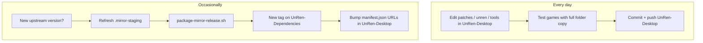

# UnRen-Dependencies mirror setup (Track A)

**Two-repo model:** pristine upstream archives live in **UnRen-Dependencies**.
Patched, py3-ported, and orchestration code stays in **UnRen-Desktop**.

You do **not** need the layout refactor or bootstrap download to set up the mirror.

---

## What goes where

| | UnRen-Dependencies | UnRen-Desktop |
|---|-------------------|---------------|
| **Purpose** | Compliance mirror; dead-link fallback | What users actually run |
| **unrpyc** | Upstream v2.0.4 (unmodified) | `tools/unrpyc-py3/` + `PATCHES.md` |
| **rpatool** | Upstream shiz/rpatool | `tools/rpatool-py3/` |
| **UnRen-forall** | Lurmel bat bundle + b64-decoded staging scripts | `tools/forall/` + local patches |
| **altrpatool** | Decoded from `UnRen-current.bat` b64 (JoeLurmel embed) | `tools/altrpatool-py3/` py3 port |
| **rpycCorrector** | Original AON/SC4X v1.04 | `tools/rpyccorrect-py3/` py3 port |
| **Licenses** | Same texts as `licenses/` (for re-fetch) | `licenses/` + `verify_compliance.py` |
| **UnRen.sh / sdk / patches** | Never | Always |

**Rule:** If you change behaviour, patch in **UnRen-Desktop** only. Refresh the mirror
when you bump an upstream version or need a new compliance snapshot.

---

## Directory layout on your machine

Keep both repos as **siblings** (two independent git clones — no submodule required):

```
~/Git/personal/
├── UnRen-Desktop/          ← daily development
└── UnRen-Dependencies/     ← mirror metadata + release assets
```

Open both in one Cursor workspace if you like (multi-root). Each has its own
`git remote`, branches, and releases.

---

## Step 1 — Create the GitHub repo

From your machine (after the local folder exists — Step 2):

```bash
cd ~/Git/personal/UnRen-Dependencies
gh repo create zujik/UnRen-Dependencies --public --source=. --remote=origin \
  --description "Vendor mirror for UnRen-Desktop bootstrap compliance (per-upstream licenses)"
git push -u origin main
```

Use `--private` if you prefer; public mirror is fine for GPL/MIT/BSD redistribution
when license files are preserved.

**Repo license on GitHub:** choose **GNU GPLv3** for the *repository curation work*.
Add a one-line note in the repo description: *Component archives retain upstream licenses.*

---

## Step 2 — Initialise local UnRen-Dependencies

Already scaffolded at `../UnRen-Dependencies/` next to UnRen-Desktop:

- `README.md` — mirror purpose
- `LICENSE` — GPL-3.0 (your curation/index work)
- `NOTICE` — attribution
- `manifest.json` — what each release contains
- `docs/SOURCE_MAP.md` — upstream URL per asset

```bash
cd ~/Git/personal/UnRen-Dependencies
git init -b main
git add README.md LICENSE NOTICE manifest.json docs/
git commit -m "Initial vendor mirror scaffold for UnRen-Desktop compliance"
```

---

## Step 3 — Stage pristine upstream (one-time per version)

In **UnRen-Desktop**, download upstream into `.mirror-staging/` (gitignored):

```bash
cd ~/Git/personal/UnRen-Desktop
mkdir -p .mirror-staging

# unrpyc 2.0.4
git clone --depth 1 --branch v2.0.4 \
  https://github.com/CensoredUsername/unrpyc.git .mirror-staging/unrpyc-2.0.4

# rpatool — canonical upstream (NOT the older embed inside the .bat)
git clone --depth 1 https://codeberg.org/shiz/rpatool.git .mirror-staging/rpatool

# UnRen-forall — clone repo (provenance + bat files on main)
git clone --depth 1 https://github.com/Lurmel/UnRen-forall.git .mirror-staging/unren-forall-repo

# The release zip is NOT inside the git tree — it lives on GitHub Releases only.
# Option A (simplest): copy the five release bats from the clone (same content as the zip)
mkdir -p .mirror-staging/unren-forall-la_0.77
cp -a .mirror-staging/unren-forall-repo/UnRen-forall.bat \
      .mirror-staging/unren-forall-repo/UnRen-current.bat \
      .mirror-staging/unren-forall-repo/UnRen-legacy.bat \
      .mirror-staging/unren-forall-repo/UnRen-cfg.txt \
      .mirror-staging/unren-forall-repo/UnRen-link.txt \
      .mirror-staging/unren-forall-la_0.77/

# Option B (exact release artifact): download + unzip instead of Option A
# curl -L -o .mirror-staging/unren-forall-release.zip \
#   https://github.com/Lurmel/UnRen-forall/releases/download/main/UnRen-forall-la_0.77-le_9.7.60-cu_9.7.80.zip
# unzip -q .mirror-staging/unren-forall-release.zip -d .mirror-staging/
# cp -a .mirror-staging/UnRen-forall-la_0.77-le_9.7.60-cu_9.7.80 \
#       .mirror-staging/unren-forall-la_0.77

# Decode embedded Python from UnRen-current.bat (NOT tools/forall/ — those are patched)
chmod +x scripts/extract-unren-forall-b64.py
python3 scripts/extract-unren-forall-b64.py \
  .mirror-staging/unren-forall-la_0.77/UnRen-current.bat \
  .mirror-staging/unren-forall-scripts

# altrpatool upstream = decoded script only
mkdir -p .mirror-staging/altrpatool-upstream
cp .mirror-staging/unren-forall-scripts/altrpatool.py .mirror-staging/altrpatool-upstream/

# rpycCorrector — from F95 forum download (not in Lurmel repo)
# Place under: .mirror-staging/rpyc-corrector-1.04/
```

If you lack the original rpycCorrector zip, note that in `SOURCE_INVENTORY.md` and
use the forum download when available; the **license file** in `licenses/` is still
valid for compliance re-fetch.

---

## Step 4 — Build release assets

From UnRen-Desktop:

```bash
./scripts/package-mirror-release.sh
```

Output: `dist/mirror-v1.0.0/` containing:

- `*.txt` license files (flat names — copied from UnRen-Desktop `licenses/`)
- `*.tar.xz` per component (from `.mirror-staging/` when present)

**Note:** GitHub Releases store assets by **basename only** (no `licenses/` folder in
download URLs). `manifest.json` → `license_download_url` must match, e.g.
`.../v1.0.0/unrpyc.MIT.txt` not `.../licenses/unrpyc.MIT.txt`.

Review the script summary for any `SKIP` lines before publishing.

---

## Step 5 — Publish GitHub Release v1.0.0

```bash
cd ~/Git/personal/UnRen-Desktop
gh release create v1.0.0 \
  dist/mirror-v1.0.0/unrpyc-2.0.4.tar.xz \
  dist/mirror-v1.0.0/rpatool.tar.xz \
  dist/mirror-v1.0.0/unren-forall-la_0.77.tar.xz \
  dist/mirror-v1.0.0/altrpatool.tar.xz \
  dist/mirror-v1.0.0/rpyc-corrector-1.04.tar.xz \
  dist/mirror-v1.0.0/*.txt \
  --repo zujik/UnRen-Dependencies \
  --title "v1.0.0 — initial compliance mirror" \
  --notes "Pristine upstream snapshots + license texts for UnRen-Desktop manifest.json"
```

Or upload via GitHub web UI: Release → v1.0.0 → attach all files from `dist/mirror-v1.0.0/`.

URLs must match `manifest.json` in UnRen-Desktop (already pointed at `v1.0.0`).

---

## Step 6 — Verify

```bash
cd ~/Git/personal/UnRen-Desktop
# Optional: delete one license and confirm re-download works
python3 scripts/verify_compliance.py .
```

All `[✓]` — mirror is live.

Add a row to `docs/SOURCE_INVENTORY.md` audit log with the release date.

---

## Step 7 — Commit UnRen-Desktop license work

When ready:

```bash
cd ~/Git/personal/UnRen-Desktop
git add -A
git status   # review
git commit -m "Relicense to GPL-3.0; add compliance manifest and mirror docs"
git push
```

---

## Day-to-day workflow (two repos)



| Action | Repo |
|--------|------|
| Fix decompile / menu / SDK | UnRen-Desktop |
| Patch unrpyc / forall | UnRen-Desktop |
| Forum release zip of full tool | UnRen-Desktop Releases |
| Upstream version bump snapshot | UnRen-Dependencies |
| License text correction | Both (Desktop first, then re-package mirror) |

**Do not** submodule-link the repos unless you enjoy extra git friction. Sibling
clones + `package-mirror-release.sh` is enough until bootstrap download is coded.

---

## What waits for refactor (Track B)

- Bootstrap `UnRen.sh` that downloads `unren-desktop/` on first run
- Auto-extract mirror tarballs inside `verify_compliance.py`
- Slim vs full release split

None of that blocks mirror setup or current full-copy usage.

---

## Related

- `docs/SOURCE_INVENTORY.md` — audit trail
- `manifest.json` — `dependencies.*.download_url`
- `scripts/package-mirror-release.sh` — build release folder
- `../UnRen-Dependencies/docs/SOURCE_MAP.md` — per-asset upstream map
